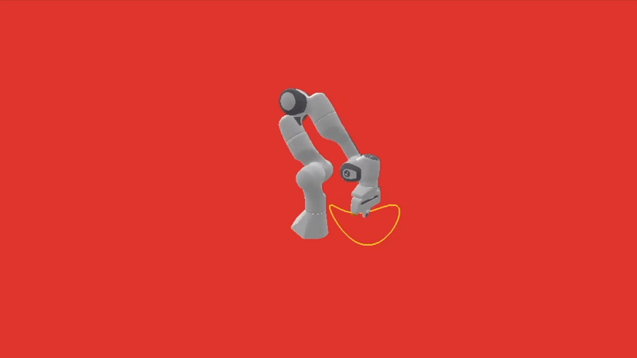
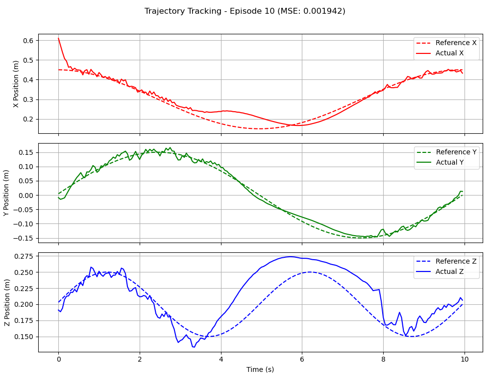

# DDPG for Panda Robot Trajectory Tracking

## 1. Overview

This project implements the Deep Deterministic Policy Gradient (DDPG) algorithm to train a Franka Emika Panda robot arm to follow a predefined 3D sinusoidal trajectory with its end-effector. The control environment is custom-built using the `panda-gym` library and `PyBullet` for physics simulation.

The agent learns to minimize the distance between its end-effector and a moving target point on the trajectory. Key reinforcement learning techniques employed include DDPG with Actor-Critic networks, target networks for stable learning, and Prioritized Experience Replay (PER) for efficient sampling of experiences. The project aims to achieve precise trajectory tracking by learning a continuous control policy.




## 2. Features

* **DDPG Agent (`ddpg_agent.py`):**
    * Actor network (`networks.ActorNetwork`): Decides the action (control signal) based on the current state. Uses `tanh` activation to output actions in the range [-1, 1].
    * Critic network (`networks.CriticNetwork`): Evaluates the action by estimating the Q-value.
    * Target networks and soft updates (τ, `config.TAU`): Used for stabilizing the learning process. Target networks are updated slowly towards the main networks.
    * Gaussian noise (`config.NOISE_STDDEV`): Added to actions during training for exploration.
    * Policy delay (`config.POLICY_DELAY`): Actor and target networks are updated less frequently than the critic, similar to TD3, for improved stability.
* **Prioritized Experience Replay (PER) (`replay_buffer.py`):**
    * Experiences (transitions) are stored with priorities based on their TD-error.
    * Sampling is biased towards transitions with higher TD-error, allowing the agent to focus on more informative experiences.
    * Importance sampling weights (`config.PER_ALPHA`, `config.PER_BETA_START`) are used to correct for the bias introduced by prioritized sampling. Beta is annealed over `config.PER_BETA_FRAMES`.
* **Custom Gym Environment (`custom_panda_env.py`):**
    * Environment ID: `PandaSinusoidTrack-v0`.
    * Task: The Panda robot's end-effector must track a 3D sinusoidal trajectory. Trajectory parameters (center, radius, frequency, amplitude, duration) are defined in `custom_panda_env.py` (e.g., `TRAJ_CENTER`, `TRAJ_RADIUS`) and mirrored in `config.py`.
    * Observation Space: A `gym.spaces.Dict` containing:
        * `observation`: The robot's proprioceptive state (e.g., joint angles, velocities from `Panda.get_obs()`).
        * `achieved_goal`: The current 3D Cartesian position of the robot's end-effector (`Panda.get_ee_position()`).
        * `desired_goal`: The current target 3D Cartesian position on the sinusoidal trajectory, updated at each step based on `self.sim_time`.
    * Action Space: Continuous, representing control signals for the robot (typically end-effector velocities, defined by `Panda.action_space`). The agent's output actions are scaled to this space.
    * Reward: Dense reward, calculated as the negative squared Euclidean distance between the `achieved_goal` (current end-effector position) and the `desired_goal` (target position on the trajectory). `SinusoidTrackTask.compute_reward()`.
    * Simulation: Powered by PyBullet. Simulation frequency (`SIM_FREQ`) and control frequency (`CONTROL_FREQ`) are defined.
    * Visualization: Supports `"human"` mode rendering, where the target trajectory and the current target point are visualized using PyBullet debug lines and a sphere.
* **Configuration (`config.py`):**
    * Centralized file for all hyperparameters related to the agent (learning rates, gamma, tau, noise), environment (name, trajectory parameters for reference), replay buffer (size, batch size, PER parameters), training (number of episodes, warmup, evaluation frequency), and evaluation (number of episodes, render delay).
* **Training (`train.py`):**
    * Handles the main training loop.
    * Initial warmup phase (`config.WARMUP_BATCHES`) where actions are sampled randomly to populate the replay buffer.
    * Periodic evaluation of the agent's performance using `evaluate_agent` from `evaluate.py` (every `config.EVAL_FREQ` episodes).
    * Saves the best-performing models (actor and critic networks) based on the average score over the last 100 episodes.
    * Plots training progress (average score over episodes) and saves it as `<MODEL_NAME>_training_progress.png`.
    * Logs episode scores, average scores, buffer size, and episode duration.
    * Includes timing information for different parts of the training step (action selection, environment step, remember, learn).
* **Evaluation (`evaluate.py`):**
    * Loads a trained agent's models.
    * Runs the agent in the environment for a set number of episodes (`config.EVAL_EPISODES`).
    * Calculates Mean Squared Error (MSE) between the actual end-effector trajectory and the reference trajectory.
    * Generates and saves detailed plots for each evaluation episode in the `eval_plots_<MODEL_NAME>/` directory:
        * 3D trajectory comparison (actual vs. reference for X, Y, Z coordinates over time).
        * Tracking error magnitude over time.
        * Control actions applied by the agent over time.
    * Supports multiple rendering modes:
        * `"human"`: Live PyBullet simulation with trajectory visualization.
        * `"rgb_array"`: Saves a GIF animation of the evaluation (filename from `config.RENDER_FILENAME`).
        * `"none"`: No rendering, for the fastest evaluation to collect metrics and plots.
    * Includes an option for action smoothing during evaluation.
* **Model Management (`networks.py`, `ddpg_agent.py`):**
    * Actor and Critic networks (and their target counterparts) can save and load their weights (`save_checkpoint`, `load_checkpoint` methods).
    * Checkpoints are stored in the `checkpoints/<MODEL_NAME>/` directory, where `MODEL_NAME` is defined in `config.py`.
* **Hindsight Experience Replay (HER) - Latent Feature (`pHER.py`):**
    * The file `pHER.py` contains utilities for HER (specifically, the 'future' strategy).
    * **Note:** As indicated in `config.py` (`HER_K` is commented out or not used) and the training script, HER is **not currently integrated** into the main training loop for this trajectory tracking task. The reward structure is dense, making HER less critical than for sparse reward tasks.

## 4. Prerequisites

* Python 3.7+
* PyTorch (tested with version compatible with CUDA if available)
* Gymnasium (`gym` in file imports, but `gymnasium` is the current standard)
* NumPy
* Matplotlib (for plotting)
* ImageIO (for saving GIFs during evaluation)
* PyBullet (for physics simulation)
* panda-gym (and its dependencies, e.g., `panda-robot`)
* Anaconda or Miniconda (for environment management)

## 5. Setup

1.  **Clone the repository (if applicable):**
    ```bash
    git clone <your-repository-url>
    cd <repository-directory> # This is your project_root
    ```

2.  **Create a Conda environment (recommended):**
    ```bash
    conda create -n panda_rl python=3.8  # Or your preferred Python 3.7+ version
    conda activate panda_rl
    ```

3.  **Install dependencies:**
    Once the environment is activated, install the required packages. It's generally a good idea to install PyTorch first, specifying the version compatible with your CUDA installation if you have a GPU.
    ```bash
    # Example for PyTorch with CUDA (check official PyTorch website for current commands)
    # conda install pytorch torchvision torchaudio cudatoolkit=11.3 -c pytorch

    # Example for PyTorch CPU-only
    # conda install pytorch torchvision torchaudio cpuonly -c pytorch

    # Then install other packages using pip within the conda environment
    pip install gymnasium numpy matplotlib imageio pybullet panda-gym
    ```
    * **Important for `panda-gym`:** Ensure `panda-gym` and its underlying `panda-robot` controller are correctly installed. You might need to follow specific installation instructions from the `panda-gym` repository if you encounter issues (e.g., related to `panda_robot` compilation or setup). Sometimes, installing `panda-gym` via `pip` within the conda environment is sufficient.

## 6. Configuration (`config.py`)

The `config.py` file is crucial as it contains all hyperparameters and settings for the project. Before running training or evaluation, review this file. Key parameters include:

* **Device:** `DEVICE` (auto-detects CUDA: `torch.device("cuda" if torch.cuda.is_available() else "cpu")`).
* **Environment:**
    * `ENV_NAME`: Should be `'PandaSinusoidTrack-v0'`.
    * Trajectory parameters (`TRAJ_CENTER`, `TRAJ_RADIUS`, `TRAJ_FREQ`, `TRAJ_Z_AMP`, `TRAJ_DURATION`, `CONTROL_FREQ`, `MAX_EPISODE_STEPS`): These define the reference trajectory. While some are hardcoded in `custom_panda_env.py`, they are listed in `config.py` for reference and could be made configurable.
* **DDPG Agent:**
    * `ACTOR_LR`, `CRITIC_LR`: Learning rates for actor and critic networks.
    * `GAMMA`: Discount factor for future rewards.
    * `TAU`: Soft update parameter for target networks.
    * `NOISE_STDDEV`, `NOISE_CLIP`: Parameters for exploration noise.
    * `POLICY_DELAY`: Frequency of actor and target network updates relative to critic updates.
    * `OPTIMIZER_WEIGHT_DECAY`: L2 regularization for optimizers.
* **Replay Buffer:**
    * `BUFFER_SIZE`: Maximum capacity of the replay buffer.
    * `BATCH_SIZE`: Number of samples drawn from the buffer for each learning step.
* **Prioritized Replay (PER):**
    * `PER_ALPHA`: Controls the degree of prioritization (0 = uniform, 1 = full prioritization).
    * `PER_BETA_START`: Initial value for importance sampling exponent, annealed towards 1.0.
    * `PER_BETA_FRAMES`: Number of frames over which beta is annealed.
    * `PER_EPSILON`: Small constant added to priorities to ensure non-zero probability.
* **Training:**
    * `N_GAMES`: Total number of training episodes.
    * `WARMUP_BATCHES`: Number of batches (steps = `WARMUP_BATCHES * BATCH_SIZE`) to fill the buffer with random actions before training starts.
    * `EVAL_FREQ`: Frequency (in episodes) for running periodic evaluations during training.
    * `CHECKPOINT_DIR`: Directory to save model checkpoints.
    * `MODEL_NAME`: Prefix for model filenames and output files (plots, GIFs).
* **Evaluation:**
    * `EVAL_EPISODES`: Number of episodes to run during a full evaluation.
    * `RENDER_DELAY`: Delay (in ms) between steps in "human" render mode for better visualization. `config.RENDER_DELAY / 1000.0` is used in `evaluate.py`.
    * `RENDER_FILENAME`: Default filename for the GIF saved during evaluation if `rgb_array` mode is used.

## 7. Custom Environment: `PandaSinusoidTrack-v0`

* **Location:** Defined and registered in `custom_panda_env.py`.
* **Task:** The Panda robot's end-effector is tasked with accurately following a 3D sinusoidal trajectory defined by `get_sinusoid_trajectory_point(t, ...)`. The target position moves over time (`self.sim_time`).
* **Observation Preprocessing:**
    * The environment returns an observation dictionary. The `preprocess_observation` function (defined in `train.py` and `evaluate.py`) is critical. It flattens and concatenates specific parts of this dictionary to form the state vector fed to the agent.
    * Specifically, it combines `observation_dict['observation']` (robot's own state) and `observation_dict['desired_goal']` (current target position on the trajectory).
    * The `ddpg_agent.DDPGAgent` calculates its `input_dims` based on the shapes of these two components from the environment's `observation_space`. Consistency here is vital.
* **Action Scaling:**
    * The DDPG agent's actor network outputs actions typically in the range [-1, 1] (due to `tanh` activation).
    * In `ddpg_agent.choose_action()`, these normalized actions are scaled to the environment's actual action space limits (`self.env.action_space.high[0]`, `self.env.action_space.low[0]`). The scaling uses `self.action_scale` and `self.action_bias` calculated during agent initialization.
    * The scaled action is then clipped to ensure it strictly stays within the environment's defined bounds.
* **Reward Function:** `SinusoidTrackTask.compute_reward(achieved_goal, desired_goal, info)` returns `-np.sum((achieved_goal - desired_goal)**2)`. This is a dense reward signal that penalizes the squared Euclidean distance between the end-effector and the target.
* **Episode Termination:**
    * An episode ends if `truncated` becomes true. This occurs when `self.current_step >= MAX_EPISODE_STEPS`.
    * The `terminated` flag (related to task success) is always `False` for this task as defined in `SinusoidTrackTask.is_success()`, meaning the task is continuous tracking rather than reaching a static goal.

## 8. How to Run

### 8.1. Training the Agent

1.  **Activate Conda Environment:**
    ```bash
    conda activate panda_rl
    ```
2.  **Configure Parameters:** Review and adjust settings in `ddpg/config.py` as needed (e.g., `N_GAMES`, learning rates, `MODEL_NAME`).
3.  **Run the Training Script:**
    From your `project_root` directory:
    ```bash
    python ddpg/train.py
    ```
    *(This assumes `ddpg_agent.py` is in `project_root/` and `train.py` can import it. If `ddpg_agent.py` is moved into `ddpg/`, the command would be `python train.py` from within the `ddpg/` directory, or `python -m ddpg.train` from `project_root/` if imports are relative.)*

4.  **Monitoring Training:**
    * **Console Output:**
        * Progress updates: Episode number, steps per episode, raw score, average score (over the last 100 episodes), current buffer size, and episode duration.
        * Warmup phase indication.
        * Periodic timing information for action selection, environment step, experience storing, and learning operations.
        * Notifications when a new best average score is achieved and models are saved.
        * Results from periodic evaluations (average score, MSE).
    * **Model Saving:**
        * The agent's models (actor, critic, target_actor, target_critic) are saved to `checkpoints/<MODEL_NAME>/` whenever a new best average score (over the last 100 episodes) is achieved.
    * **Final Plot:**
        * Upon completion, a plot named `<MODEL_NAME>_training_progress.png` showing the average score history will be saved in the `project_root` directory.

### 8.2. Evaluating a Trained Agent

1.  **Activate Conda Environment:**
    ```bash
    conda activate panda_rl
    ```
2.  **Ensure Trained Models Exist:** Make sure you have trained models saved in the `checkpoints/<MODEL_NAME>/` directory (where `<MODEL_NAME>` matches the one in `config.py` used during training and set for evaluation).
3.  **Configure Evaluation:**
    * Open `ddpg/evaluate.py`.
    * Set the `EVAL_RENDER_MODE` variable at the beginning of the `if __name__ == "__main__":` block:
        * `"human"`: For live PyBullet visualization. This is slower and allows you to watch the robot. The trajectory and target marker will be drawn.
        * `"rgb_array"`: To save a GIF animation of the evaluation. The filename is determined by `config.RENDER_FILENAME` (e.g., `ddpg_traj_track_evaluation.gif`). Plots will also be generated.
        * `"none"`: For the fastest evaluation without any live rendering. Plots will still be generated.
    * You can adjust `config.EVAL_EPISODES` to change the number of episodes for evaluation.
    * The `config.RENDER_DELAY` (in milliseconds) controls the pause between steps in `"human"` mode.
    * Action smoothing can be enabled/disabled in `evaluate.py` by uncommenting/commenting the relevant lines in the evaluation loop.
4.  **Run the Evaluation Script:**
    From your `project_root` directory:
    ```bash
    python ddpg/evaluate.py
    ```
    *(Similar import path considerations as for `train.py` apply here.)*

5.  **Expected Output:**
    * **Console Output:**
        * Summary of evaluation: Number of episodes, average score, average Mean Squared Error (MSE), average episode length.
    * **Plots:**
        * Detailed plots for each evaluation episode will be saved in a new directory named `eval_plots_<MODEL_NAME>/` inside `project_root`. These include:
            * `eval_ep_<episode_num>_trajectory.png`: Comparison of actual vs. reference trajectory for X, Y, and Z coordinates over time.
            * `eval_ep_<episode_num>_error.png`: Magnitude of the tracking error (Euclidean distance) over time.
            * `eval_ep_<episode_num>_actions.png`: Control actions (e.g., end-effector velocities) applied by the agent for each dimension over time.
    * **GIF Animation:**
        * If `EVAL_RENDER_MODE` was `"rgb_array"`, a GIF animation (e.g., `ddpg_traj_track_evaluation.gif`) will be saved in the `project_root` directory.

## 9. Process Details

* **Agent Initialization (`ddpg_agent.py`):**
    * The agent's `input_dims` (dimension of the state vector input to networks) is automatically determined by inspecting the `env.observation_space`. It sums the dimensions of `env.observation_space['observation']` and `env.observation_space['desired_goal']`.
    * Action scaling parameters (`action_scale`, `action_bias`) are calculated based on `env.action_space.high` and `env.action_space.low`.
* **Prioritized Experience Replay (`replay_buffer.py`):**
    * When a transition is stored (`store_transition`), it's initially given `self.max_priority` to ensure new experiences are likely to be sampled soon.
    * During sampling (`sample`), probabilities for each transition are calculated as $p_i^\alpha / \sum_j p_j^\alpha$, where $p_i$ is the priority (derived from TD error) and $\alpha$ is `config.PER_ALPHA`.
    * Importance sampling weights $w_i = (N \cdot P(i))^{-\beta} / \max_j(w_j)$ are calculated to correct the bias from non-uniform sampling. $\beta$ is annealed from `config.PER_BETA_START` to 1.0.
    * After a learning step, priorities of the sampled transitions are updated (`update_priorities`) using the new TD errors: `priority = abs(td_error) + config.PER_EPSILON`.
* **Learning Step (`ddpg_agent.learn()`):**
    * **Critic Update:**
        1.  Target actions are computed using the target actor network with added noise: `next_actions = target_actor(new_states) + noise`.
        2.  Target Q-values are computed: `target_q = rewards + gamma * target_critic(new_states, next_actions) * (1 - dones)`.
        3.  The critic network is updated by minimizing the MSE loss between `current_q = critic(states, actions)` and `target_q`. This loss is weighted by the importance sampling weights.
    * **Actor Update (Delayed):**
        1.  Occurs every `config.POLICY_DELAY` steps.
        2.  The actor network is updated by maximizing the critic's evaluation of the actor's output: `actor_loss = -critic(states, actor(states)).mean()`.
    * **Target Network Updates (Delayed):**
        1.  After the actor update, target networks are soft-updated: `target_param = tau * param + (1 - tau) * target_param`.
* **Trajectory Visualization (`custom_panda_env.py`):**
    * In `"human"` render mode, `_draw_trajectory_line()` draws the complete reference sinusoidal path at the beginning of an episode using `p.addUserDebugLine`.
    * `_create_target_marker()` creates a sphere.
    * `_update_target_marker()` moves this sphere to the current `reference_ee_pos` (desired goal) at each step.

## 10. Expected Results

* **Training:**
    * Console logs showing increasing average scores over episodes.
    * Saved model checkpoint files in `checkpoints/<MODEL_NAME>/`.
    * A `_training_progress.png` plot illustrating the learning curve (average reward per episode).
* **Evaluation:**
    * Console output summarizing performance (average score, MSE).
    * A folder `eval_plots_<MODEL_NAME>/` containing:
        * Trajectory plots showing the robot's end-effector closely following the reference path in X, Y, and Z dimensions.
        * Error plots showing the tracking error magnitude decreasing or staying low over time.
        * Action plots showing the control signals generated by the agent.
    * If `EVAL_RENDER_MODE = "rgb_array"`, a `.gif` animation demonstrating the robot's tracking behavior.
    * Successful training should result in low Mean Squared Error (MSE) values during evaluation, indicating accurate tracking. The visual plots and GIF will provide qualitative confirmation.

## 11. Notes and Troubleshooting

* **`KMP_DUPLICATE_LIB_OK='TRUE'`:**
    This environment variable is set at the beginning of `train.py` and `evaluate.py` (`os.environ['KMP_DUPLICATE_LIB_OK']='TRUE'`). It's a workaround to suppress errors related to OpenMP runtime library conflicts that can occur if multiple libraries (like NumPy, SciPy, and PyTorch compiled with MKL) link their own OpenMP runtimes. While it often resolves the error message, it might mask underlying performance issues or instabilities in specific complex setups. If you encounter unexplained crashes, this could be a factor.
* **PyBullet Display Issues:**
    If the PyBullet window doesn't appear during "human" mode rendering, or if you experience other display-related problems:
    * Ensure your graphics drivers are up-to-date.
    * Verify that PyBullet is installed correctly and is compatible with your system's graphics setup (e.g., you might need a desktop environment).
    * Running on a headless server might prevent "human" mode rendering unless X11 forwarding or a virtual framebuffer (like Xvfb) is configured.
* **`panda-gym` Installation:**
    `panda-gym` has its own set of dependencies and installation steps. Issues like "environment not found" (even if `custom_panda_env.py` seems to register it) or errors originating from within `panda-gym`'s codebase often point to problems with its installation or the underlying `panda-robot` controller setup. Refer to the official `panda-gym` documentation.
* **Observation Preprocessing Consistency:**
    The `preprocess_observation` function (defined in `train.py` and `evaluate.py`) is critical. It **must** correctly extract and concatenate the `observation` and `desired_goal` fields from the dictionary returned by the environment. The agent's `input_dims` is derived based on this assumption. Any mismatch will lead to errors or very poor performance.
* **CUDA/Device Configuration:**
    Ensure PyTorch is correctly installed with CUDA support if you intend to use a GPU. The `config.DEVICE` setting handles device selection automatically. Check console output at the start of `train.py` for PyTorch, CUDA versions, and selected device.
* **Performance and Hyperparameters:**
    Achieving good tracking performance is highly dependent on hyperparameter tuning (`config.py`). If the robot fails to track or behaves erratically, consider adjusting learning rates, noise parameters, network architectures (in `networks.py`), or reward scaling (though the current reward is standard).
* **Action Smoothing in Evaluation:**
    The `evaluate.py` script contains an optional action smoothing mechanism (using an exponential moving average). This can sometimes lead to smoother robot motion during evaluation but is not part of the trained policy itself. Its effect can be observed by enabling/disabling it.

