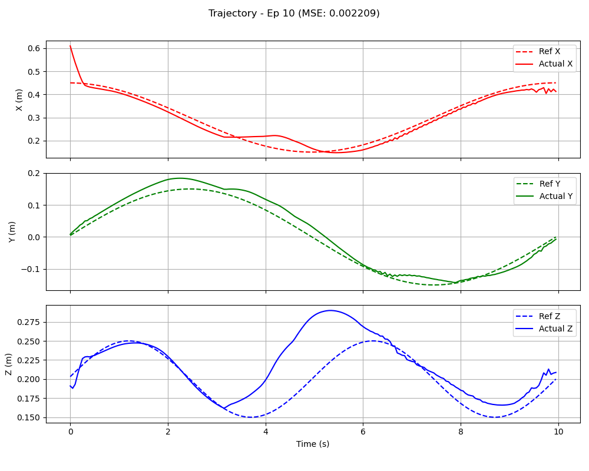

# RDPG for Panda Robot Trajectory Tracking

## 1. Overview

This project implements the Recurrent Deterministic Policy Gradient (RDPG) algorithm to train a Franka Emika Panda robot arm to follow a predefined 3D sinusoidal trajectory with its end-effector. The control environment is custom-built using the `panda-gym` library and PyBullet for physics simulation.

The agent learns to minimize the distance between its end-effector and a moving target point on the trajectory. Key reinforcement learning techniques employed include RDPG with recurrent Actor-Critic networks (using LSTMs), target networks for stable learning, and Prioritized Experience Replay (PER) for efficient sampling of experiences. The project aims to achieve precise trajectory tracking by learning a continuous control policy that can leverage temporal dependencies in the observation stream.




## 2. Features

* **RDPG Agent (`rdpg_agent.py`):**
    * **Recurrent Actor network (`networks.ActorNetwork`):** Decides the action (control signal) based on the current state and its internal recurrent (LSTM) state. Uses `tanh` activation to output actions in the range [-1, 1].
    * **Recurrent Critic network (`networks.CriticNetwork`):** Evaluates the action by estimating the Q-value, also utilizing an LSTM to process sequences of states and actions.
    * **Target networks and soft updates** (`τ`, `config.TAU`): Used for stabilizing the learning process. Target networks are updated slowly towards the main networks.
    * **Gaussian noise (`config.NOISE_STDDEV`):** Added to actions during training for exploration.
    * **Policy delay (`config.POLICY_DELAY`):** Actor and target networks are updated less frequently than the critic, similar to TD3, for improved stability.
    * **LSTM Hidden States:** The agent manages and passes LSTM hidden states (`h_actor`, `c_actor`, `h_critic`, `c_critic`) during action selection and learning.
* **Prioritized Experience Replay (PER) (`replay_buffer.py`):**
    * Experiences (transitions), along with the **actor's LSTM hidden and cell states** at the time of the transition, are stored with priorities based on their TD-error.
    * Sampling is biased towards transitions with higher TD-error, allowing the agent to focus on more informative experiences.
    * Importance sampling weights (`config.PER_ALPHA`, `config.PER_BETA_START`) are used to correct for the bias introduced by prioritized sampling. Beta is annealed over `config.PER_BETA_FRAMES`.
* **Custom Gym Environment (`custom_panda_env.py`):**
    * **Environment ID:** `PandaSinusoidTrack-v0`.
    * **Task:** The Panda robot's end-effector must track a 3D sinusoidal trajectory. Trajectory parameters (center, radius, frequency, amplitude, duration) are defined in `custom_panda_env.py` (e.g., `TRAJ_CENTER`, `TRAJ_RADIUS`) and mirrored in `config.py`.
    * **Observation Space:** A `gym.spaces.Dict` containing:
        * `observation`: The robot's proprioceptive state (e.g., partial end-effector pose, potentially joint angles/velocities from `Panda.get_obs()` if configured). *The RDPG agent specifically uses a subset defined as the robot's 'partial observation'.*
        * `achieved_goal`: The current 3D Cartesian position of the robot's end-effector (`Panda.get_ee_position()`).
        * `desired_goal`: The current target 3D Cartesian position on the sinusoidal trajectory, updated at each step based on `self.sim_time`.
    * **Action Space:** Continuous, representing control signals for the robot (typically end-effector velocities, defined by `Panda.action_space`). The agent's output actions are scaled to this space.
    * **Reward:** Dense reward, calculated as the negative squared Euclidean distance between the `achieved_goal` (current end-effector position) and the `desired_goal` (target position on the trajectory). `SinusoidTrackTask.compute_reward()`.
    * **Simulation:** Powered by PyBullet. Simulation frequency (`SIM_FREQ`) and control frequency (`CONTROL_FREQ`) are defined.
    * **Visualization:** Supports `"human"` mode rendering, where the target trajectory and the current target point are visualized using PyBullet debug lines and a sphere.
* **Configuration (`config.py`):**
    * Centralized file for all hyperparameters related to the agent (learning rates, gamma, tau, noise, **LSTM parameters like `LSTM_HIDDEN_SIZE`, `LSTM_NUM_LAYERS`**), environment (name, trajectory parameters for reference), replay buffer (size, batch size, PER parameters), training (number of episodes, warmup, evaluation frequency), and evaluation (number of episodes, render delay).
* **Training (`train.py`):**
    * Handles the main training loop for the RDPG agent.
    * Initial warmup phase (`config.WARMUP_BATCHES`) where actions are sampled randomly to populate the replay buffer.
    * Periodic evaluation of the agent's performance using `evaluate_agent` from `evaluate.py` (every `config.EVAL_FREQ` episodes).
    * Saves the best-performing models (actor and critic networks) based on the average score over the last 100 episodes.
    * Plots training progress (average score over episodes) and saves it as `<MODEL_NAME>_training_progress.png`.
    * Logs episode scores, average scores, buffer size, and episode duration.
    * Includes timing information for different parts of the training step.
* **Evaluation (`evaluate.py`):**
    * Loads a trained RDPG agent's models.
    * Runs the agent in the environment for a set number of episodes (`config.EVAL_EPISODES`), properly handling recurrent states.
    * Calculates Mean Squared Error (MSE) between the actual end-effector trajectory and the reference trajectory.
    * Generates and saves detailed plots for each evaluation episode in the `eval_plots_<MODEL_NAME>/` directory:
        * 3D trajectory comparison (actual vs. reference for X, Y, Z coordinates over time).
        * Tracking error magnitude over time.
        * Control actions applied by the agent over time.
    * Supports multiple rendering modes:
        * `"human"`: Live PyBullet simulation with trajectory visualization.
        * `"rgb_array"`: Saves a GIF animation of the evaluation (filename from `config.RENDER_FILENAME`).
        * `"none"`: No rendering, for the fastest evaluation to collect metrics and plots.
    * Includes an option for action smoothing during evaluation.
* **Model Management (`networks.py`, `rdpg_agent.py`):**
    * Recurrent Actor and Critic networks (and their target counterparts) can save and load their weights (`save_checkpoint`, `load_checkpoint` methods).
    * Checkpoints are stored in the `checkpoints/<MODEL_NAME>/` directory, where `MODEL_NAME` is defined in `config.py`.

## 3. Directory Structure
project_root/
├── rdpg/                     # Main RDPG algorithm and environment code
│   ├── config.py             # Hyperparameters and settings
│   ├── custom_panda_env.py   # Custom Gym environment definition
│   ├── evaluate.py           # Script for evaluating a trained agent
│   ├── networks.py           # Recurrent Actor and Critic network definitions
│   ├── replay_buffer.py      # Prioritized Experience Replay buffer (stores hidden states)
│   ├── train.py              # Main training script
│   └── readme.md             # This README file
├── rdpg_agent.py             # RDPG agent class (at project_root or inside rdpg/)
├── checkpoints/              # Directory for saved model weights (created during training)
│   └── &lt;MODEL_NAME>/         # Specific model's checkpoint directory
│       ├── actor.pth
│       ├── critic.pth
│       ├── target_actor.pth
│       └── target_critic.pth
├── eval_plots_&lt;MODEL_NAME>/  # Directory for evaluation plots (created during evaluation)
│   └── eval_ep_00_trajectory.png
│   └── ...
├── &lt;MODEL_NAME>_training_progress.png # Plot of training scores (created after training)
└── &lt;MODEL_NAME>_evaluation.gif        # GIF from evaluation (if rgb_array mode is used)
*(Note: Adjust paths in "How to Run" and import statements if `rdpg_agent.py` is inside the `rdpg/` subfolder.)*

## 4. Prerequisites

* Python 3.7+
* PyTorch (tested with version compatible with CUDA if available)
* Gymnasium (`gym` in file imports, but `gymnasium` is the current standard)
* NumPy
* Matplotlib (for plotting)
* ImageIO (for saving GIFs during evaluation)
* PyBullet (for physics simulation)
* panda-gym (and its dependencies, e.g., `panda-robot`)
* Anaconda or Miniconda (for environment management)

## 5. Setup

1.  **Clone the repository (if applicable):**
    ```bash
    git clone <your-repository-url>
    cd <repository-directory> # This is your project_root
    ```

2.  **Create a Conda environment (recommended):**
    ```bash
    conda create -n panda_rl_rdpg python=3.8 # Or your preferred Python 3.7+ version
    conda activate panda_rl_rdpg
    ```

3.  **Install dependencies:**
    Once the environment is activated, install the required packages. It's generally a good idea to install PyTorch first, specifying the version compatible with your CUDA installation if you have a GPU.
    ```bash
    # Example for PyTorch with CUDA (check official PyTorch website for current commands)
    # conda install pytorch torchvision torchaudio cudatoolkit=11.x -c pytorch
    # Example for PyTorch CPU-only
    # conda install pytorch torchvision torchaudio cpuonly -c pytorch

    # Then install other packages using pip within the conda environment
    pip install gymnasium numpy matplotlib imageio pybullet panda-gym
    ```

4.  **Important for `panda-gym`:**
    Ensure `panda-gym` and its underlying `panda-robot` controller are correctly installed. You might need to follow specific installation instructions from the `panda-gym` repository if you encounter issues (e.g., related to `panda_robot` compilation or setup).

## 6. Configuration (`config.py`)

The `config.py` file is crucial. Review this file before running training or evaluation. Key RDPG-specific parameters include:
* **Device:** `DEVICE` (auto-detects CUDA).
* **Environment:** `ENV_NAME` (should be `'PandaSinusoidTrack-v0'`). Trajectory parameters are also listed for reference.
* **RDPG Agent:**
    * `ACTOR_LR`, `CRITIC_LR`: Learning rates.
    * `GAMMA`: Discount factor.
    * `TAU`: Soft update parameter.
    * `NOISE_STDDEV`, `NOISE_CLIP`: Exploration noise parameters.
    * `POLICY_DELAY`: Frequency of actor/target updates relative to critic.
    * `LSTM_HIDDEN_SIZE`: Size of the hidden state for LSTM layers in Actor and Critic.
    * `LSTM_NUM_LAYERS`: Number of LSTM layers.
* **Replay Buffer:**
    * `BUFFER_SIZE`: Max capacity (note: storing hidden states might require more memory or a smaller buffer than typical DDPG).
    * `BATCH_SIZE`: Batch size for learning (often smaller for RNNs).
* **Prioritized Replay (PER):** `PER_ALPHA`, `PER_BETA_START`, `PER_BETA_FRAMES`, `PER_EPSILON`.
* **Training:** `N_GAMES`, `WARMUP_BATCHES`, `EVAL_FREQ`, `CHECKPOINT_DIR`, `MODEL_NAME`.
* **Evaluation:** `EVAL_EPISODES`, `RENDER_DELAY`, `RENDER_FILENAME`.

## 7. Custom Environment: `PandaSinusoidTrack-v0`

* **Location:** Defined and registered in `custom_panda_env.py`.
* **Task:** Track a 3D sinusoidal trajectory.
* **Observation Preprocessing:**
    * The environment returns an observation dictionary. The `preprocess_observation` function (defined in `train.py` and `evaluate.py`) is critical. It flattens and concatenates `observation_dict['observation']` (robot's own partial state, e.g., 6D end-effector pose) and `observation_dict['desired_goal']` (current target position on the trajectory) to form the state vector for the RDPG agent.
    * The `rdpg_agent.RDPGAgent` calculates its `input_dims` based on the shapes of these two components. Consistency is vital.
* **Action Scaling:**
    * The RDPG agent's actor network outputs actions in [-1, 1].
    * In `rdpg_agent.choose_action()`, these are scaled to the environment's action space limits.
* **Reward Function:** `-np.sum((achieved_goal - desired_goal)**2)` (negative squared Euclidean distance).
* **Episode Termination:** Ends if `truncated` (max steps reached). `terminated` (task success) is always `False` for continuous tracking.

## 8. How to Run

### 8.1. Training the Agent

1.  **Activate Conda Environment:**
    ```bash
    conda activate panda_rl_rdpg
    ```
2.  **Configure Parameters:** Review and adjust settings in `rdpg/config.py` (e.g., `N_GAMES`, learning rates, `MODEL_NAME`, `LSTM_HIDDEN_SIZE`).
3.  **Run the Training Script:** From your `project_root` directory:
    ```bash
    python rdpg/train.py
    ```
    *(Adjust command if `rdpg_agent.py` is in `rdpg/`: `python train.py` from `rdpg/`, or `python -m rdpg.train` from `project_root/`)*

4.  **Monitoring Training:**
    * **Console Output:** Episode progress, scores, average scores, buffer size, episode duration, warmup phase, periodic evaluation results (MSE).
    * **Model Saving:** Models saved to `checkpoints/<MODEL_NAME>/` on new best average score.
    * **Final Plot:** `<MODEL_NAME>_training_progress.png` (average score history) saved in `project_root`. (See `rdpg_traj_track_train_score.png` for an example of the expected plot).

### 8.2. Evaluating a Trained Agent

1.  **Activate Conda Environment:**
    ```bash
    conda activate panda_rl_rdpg
    ```
2.  **Ensure Trained Models Exist:** In `checkpoints/<MODEL_NAME>/`.
3.  **Configure Evaluation:**
    * Open `rdpg/evaluate.py`.
    * Set `EVAL_RENDER_MODE` at the beginning of `if __name__ == "__main__":`:
        * `"human"`: Live PyBullet visualization.
        * `"rgb_array"`: Save a GIF (filename from `config.RENDER_FILENAME`).
        * `"none"`: Fastest, no live rendering (plots still generated).
    * Adjust `config.EVAL_EPISODES`, `config.RENDER_DELAY` as needed.
4.  **Run the Evaluation Script:** From `project_root`:
    ```bash
    python rdpg/evaluate.py
    ```
    *(Adjust command similar to training if needed)*
5.  **Expected Output:**
    * **Console Output:** Evaluation summary (avg score, avg MSE, avg length).
    * **Plots:** Saved in `eval_plots_<MODEL_NAME>/` (trajectory, error, actions per episode).
    * **GIF Animation:** If `EVAL_RENDER_MODE` was `"rgb_array"`.

## 9. Process Details

* **Agent Initialization (`rdpg_agent.py`):**
    * `input_dims` determined from `env.observation_space['observation']` and `env.observation_space['desired_goal']`.
    * Initial LSTM hidden states (`h_0`, `c_0`) are typically zero vectors.
* **Recurrent Networks (`networks.py`):**
    * Actor and Critic networks incorporate LSTM layers. The `forward` pass takes the current observation and the previous hidden/cell states, returning the output (action or Q-value) and the new hidden/cell states.
* **Replay Buffer (`replay_buffer.py`):**
    * `store_transition` now also stores `h_in_actor` and `c_in_actor` (the actor's LSTM hidden states *before* processing the current state to get the action).
    * `sample` retrieves these stored hidden states along with other transition data.
* **Learning Step (`rdpg_agent.learn()`):**
    * **Critic Update:**
        * Target actions are computed using the target actor network, feeding in the new states and the **initial hidden states for the sequence (or stored hidden states if replaying sequences)**.
        * Target Q-values are computed using the target critic, similarly handling recurrent states.
        * The critic is updated by minimizing MSE loss, weighted by importance sampling weights.
    * **Actor Update (Delayed):**
        * Occurs every `config.POLICY_DELAY` steps.
        * The actor is updated by maximizing the critic's evaluation of the actor's output (actions derived from current states and appropriate hidden states).
    * **Target Network Updates (Delayed):** Soft updates applied.
* **Trajectory Visualization (`custom_panda_env.py`):**
    * Visualizes the reference trajectory and moving target point in "human" mode.

## 10. Expected Results

* **Training:**
    * Console logs showing increasing average scores.
    * Saved model checkpoints.
    * A `_training_progress.png` plot (like `rdpg_traj_track_train_score.png`).
* **Evaluation:**
    * Low Mean Squared Error (MSE) values.
    * Plots and GIF showing accurate trajectory tracking.

## 11. Notes and Troubleshooting

* **`KMP_DUPLICATE_LIB_OK='TRUE'`:** Set in `train.py` and `evaluate.py` as a workaround for OpenMP conflicts.
* **PyBullet Display Issues:** Ensure up-to-date graphics drivers and correct PyBullet installation. Headless servers may need X11 forwarding or Xvfb.
* **`panda-gym` Installation:** Refer to official `panda-gym` documentation for installation issues.
* **Observation Preprocessing Consistency:** Crucial for `preprocess_observation` in `train.py` and `evaluate.py` to match the agent's expected `input_dims`.
* **CUDA/Device Configuration:** Verify PyTorch CUDA setup.
* **Performance and Hyperparameters:** RDPG can be sensitive. Tuning learning rates, LSTM architecture (`LSTM_HIDDEN_SIZE`, `LSTM_NUM_LAYERS`), `BATCH_SIZE`, and replay buffer settings is often necessary. RDPG is generally more computationally intensive than DDPG.
* **Action Smoothing in Evaluation:** Optional feature in `evaluate.py`.
* **Recurrent State Management:** Ensure hidden states are correctly initialized at the start of episodes and passed through the networks and replay buffer. The current implementation stores and replays *transition-wise* hidden states for the actor, which is a common simplification. True BPTT through sequences from the buffer is more complex.
